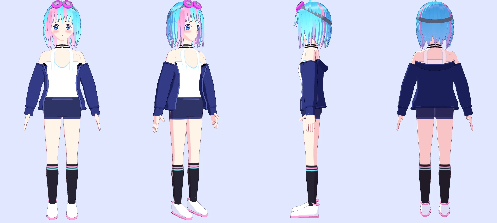
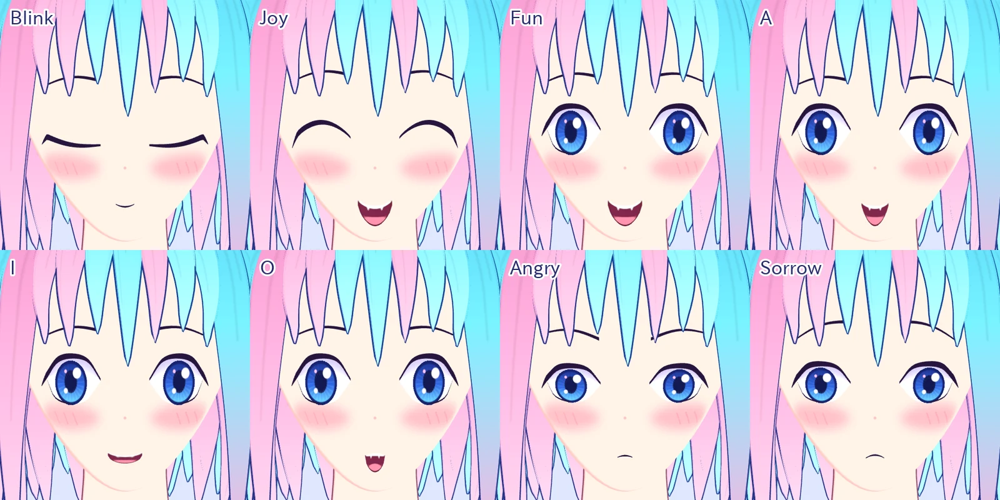

# ほんごうねむり VRMモデル

キービジュアル（第2回配信）と `site.json` の配色・デザインメモに合わせた
VTuber用の3Dモデルです。




```
model/
  nemuri.vrm      モデル本体（VRM 0.0）。配信ソフトにはこれを読み込む
  make_vrm.py     nemuri.vrm を作るスクリプト。形・色・表情はすべてここ
  viewer.html     ブラウザで確認するためのビューア
  preview/        上の画像と、VRMに埋め込むサムネイル
```

## 使い方

`nemuri.vrm` を、そのまま次のようなソフトで読み込めます。

- VSeeFace / VMagicMirror / 3tene / Warudo などの配信ソフト
- VRoid Hub、cluster、Unity（UniVRM 0.x）

形式は **VRM 0.0** です。いちばん多くのソフトが読める版なので、こちらにしています。

### ブラウザで見る

```sh
cd vtuber/model
python3 -m http.server 8765    # http://127.0.0.1:8765/viewer.html
```

ドラッグで回転、下のボタンで表情が切り替わります。

## 入っているもの

| 項目 | 内容 |
| --- | --- |
| 骨格 | VRMヒューマノイドの必須ボーンに加え、肩・上胸・目・つま先・指（全15本×左右） |
| 表情 | まばたき（両目・片目）、あいうえお、Joy・Angry・Sorrow・Fun |
| 視線 | 目のボーンで動く（左右9°・上下5°） |
| 揺れもの | 髪（後ろ・サイド・前髪）とアホ毛、あわせて43本。頭・首・胸・上腕に当たり判定 |
| 見た目 | MToon（トゥーン）シェーダー、輪郭線つき |
| 規模 | 約4.7万頂点・8.5万ポリゴン、テクスチャ6枚、4.7 MB |

デザインとの対応:

- **髪** — シアンのボブに、右側（本人から見て）と内側がピンク。アホ毛が一本。
- **ゴーグル** — マゼンタのフレームで、頭の上に上げたまま。
- **チョーカー** — 黒の二連、中央に白い玉。
- **服** — 白のタンクトップ（水色の縁取り）に、肩からずり落ちた紺のパーカー。
  下は紺のショートパンツ、黒のハイソックス、白とピンクのスニーカー。
- **顔** — 青い大きな目、ほっぺの赤み。「Fun」と「Joy」の口は八重歯つきで、
  キービジュアルの笑顔に寄せています。

キービジュアルに描かれていない下半身は、この案で作っています。

## 作り直す・直す

モデルはすべて `make_vrm.py` から作っています。数字を変えて実行し直せば反映されます。

```sh
pip install numpy pillow
python3 model/make_vrm.py        # vtuber/ で実行。model/nemuri.vrm を上書き
```

よく触りそうな場所:

| 変えたいもの | `make_vrm.py` の場所 |
| --- | --- |
| 色 | 先頭の `# palette` と、末尾近くの `MATERIALS` |
| 髪の長さ・房の数 | `build_hair()` |
| 目の大きさ・形 | `EYE_W` / `EYE_H` と `UPPER` / `LOWER` |
| 表情の組み合わせ | `build()` の中の `groups` |
| 頭の大きさ | `HEAD_SCALE` |
| 利用条件（下記） | `build()` の中の `"meta"` |

同じ入力からは毎回同じファイルができます。

## 利用条件（VRMに書き込んである値）

| 項目 | 値 |
| --- | --- |
| アバターとして使ってよい人 | 作者のみ |
| 暴力表現 / 性的表現 | 不可 / 不可 |
| 商用利用 | 可（収益化した配信のため） |
| ライセンス | 再配布禁止 |

作者名は仮に「Hongou Nemuri」にしています。違う場合は `"meta"` を直して作り直してください。

## 注意

- **これは叩き台です。** プログラムで作ったモデルなので、手描きのイラストほどの
  細かさはありません。本番用にモデラーさんへ依頼するときの、色・パーツ・表情の
  見本としても使えます。
- `site.json` の「モデリング / リギング」の担当者名は空のままにしています。
- VRChat 用ではありません（VRChat は VRM を直接は読めません）。
